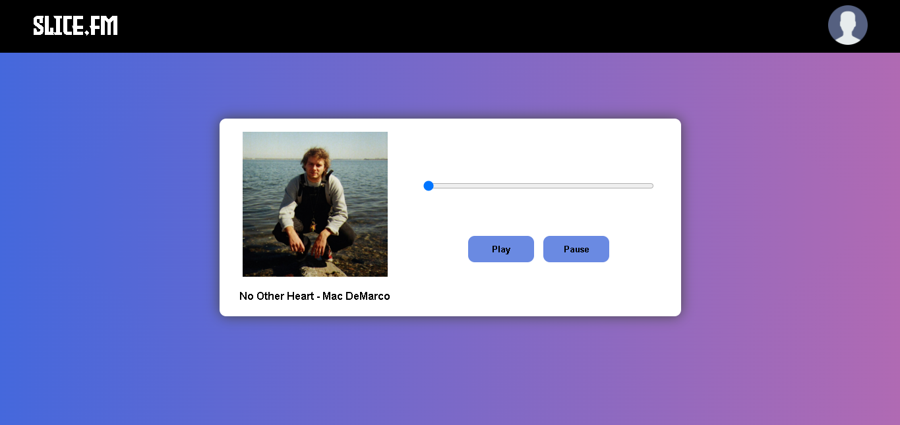

# Slice.fm

Slice.fm é um site de reprodução de músicas que permite aos usuários ouvir suas músicas favoritas em qualquer lugar, a qualquer hora.

## Recursos

- **Reprodução de Músicas:** Ouça uma ampla variedade de músicas de diferentes gêneros.
- **Controles de Reprodução:** Controle a reprodução com botões de play, pause, avançar e retroceder.
- **Barra de Progresso:** Veja o progresso da música com uma barra de progresso interativa.

## Instalação

1. Clone este repositório: `git clone https://github.com/seu-usuario/slice-fm.git`
2. Navegue até o diretório do projeto: `cd slice-fm`
3. Abra o arquivo `index.html` em seu navegador web preferido.

## Contribuição

Contribuições são bem-vindas! Se você encontrar algum problema ou tiver uma ideia para melhorar o Slice.fm, sinta-se à vontade para abrir uma [issue](https://github.com/seu-usuario/slice-fm/issues) ou enviar um [pull request](https://github.com/seu-usuario/slice-fm/pulls).

## Licença

Este projeto está licenciado sob a Licença [Mozilla Public License 2.0 (MPL-2.0)](https://opensource.org/licenses/MPL-2.0). Veja o arquivo [LICENSE](LICENSE) para mais detalhes.
